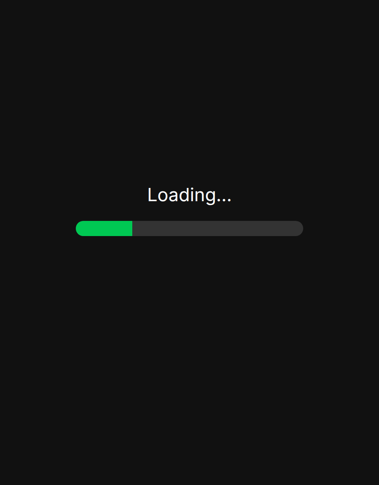
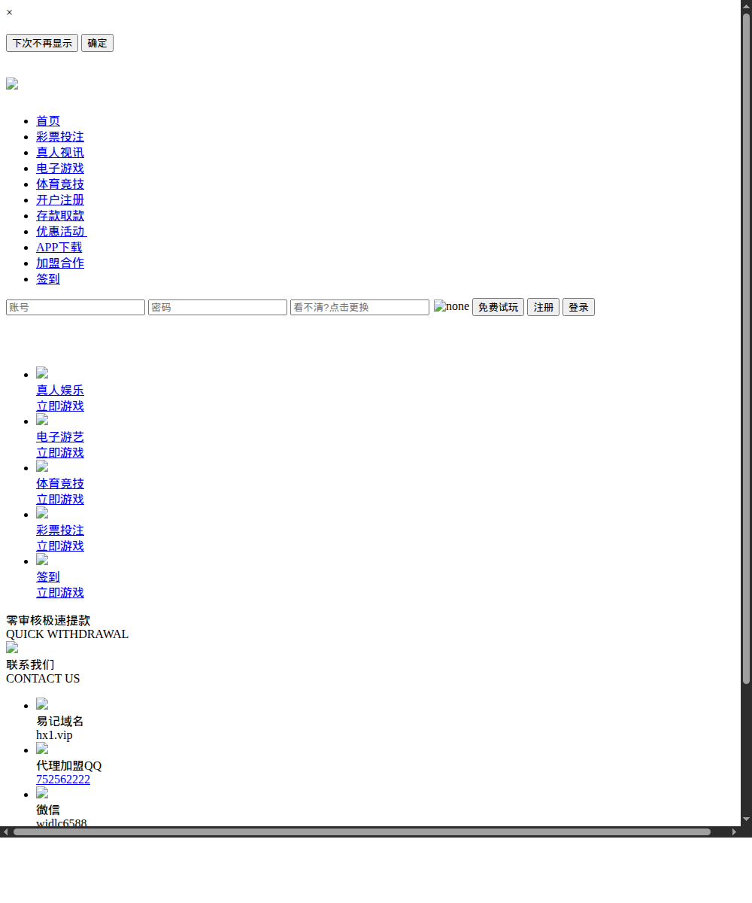

<div align="center">

# 🛡️ Forensic Case Report
## "Kuota Gratis 81GB Spesial HUT RI ke-81" — WhatsApp Phishing / CPA-Fraud Campaign

**A complete, evidence-backed threat-intelligence dissection of a nationwide Indonesian scam.**


</div>

---

## 📑 Table of Contents

1. [Executive Summary](#-executive-summary)
2. [Visual Evidence](#-visual-evidence)
3. [How the Scam Works](#-how-the-scam-works-step-by-step)
4. [Attack Chain](#-attack-chain)
5. [Infrastructure](#-infrastructure)
6. [Key Findings](#-key-findings)
7. [Attribution](#-attribution)
8. [Impact & Risk](#-impact--risk-to-victims)
9. [Methodology & Integrity](#-methodology--integrity)
10. [Documents](#-documents-in-this-case)
11. [Reporting & Remediation](#-reporting--remediation)
12. [Disclaimer](#-disclaimer)

---

## 📄 Executive Summary

On and around Indonesia's 81st Independence Day (**17 August 2026**), a WhatsApp chain message
offering **"Free 81 GB data quota"** spread rapidly among Indonesian users. This report documents a
full forensic dissection of that campaign, carried out entirely with **passive, read-only** techniques.

The message links to a fake, Facebook-styled landing page (`kuota-gratis-81gb98.1grd.xyz`) that shows
**fabricated social proof** (fake likes, comments, and "6,301 users just claimed") and **forces the
victim to re-share the link on WhatsApp** before a "DAPATKAN 81 GB" button becomes active. Clicking it
routes the victim — through a `/go.php` redirector and a **device-fingerprinting cloaker**
(`free.gf920.com`) — into **rotating CPA / real-time-bidding (RTB) ad networks** (`ldl1.com`,
`obqj3.com`). **No data quota is ever delivered.** The operators earn money by selling the victim's
click (traffic arbitrage), and the forced-share mechanic makes the campaign spread for free.

Key outcomes of the investigation:

- **The full 6-hop attack chain** was reconstructed and confirmed with independent browser renders.
- **Two real origin servers were de-cloaked** behind Cloudflare: `108.178.23.116` (INAP, Chicago) and
  `95.217.42.163` (Hetzner, Helsinki).
- A **network of 506 domains / 548 hosts** was mapped and liveness-tagged (**222 live**).
- A **second product line** was uncovered — a **Telegram Mini App "quiz" earn-to-payout scam** — run
  by the same operator, sharing analytics infrastructure.
- **Attribution** points to a **Mandarin-speaking operator**: the cloaker domain `gf920.com` has a
  **2018 history as a Chinese online-gambling site** ("和信娱乐城", Hexin Entertainment City).
- The campaign was independently **declared a hoax by Kemenkomdigi (Indonesia)** and widely reported
  by national media.

> **Bottom line:** this is a professionally-run, multi-product traffic-arbitrage operation — not a
> lone amateur page. It is monetized through ad fraud and forced propagation rather than direct data
> theft, though public reporting indicates a **data-harvesting sibling variant** also exists.

---

## 📸 Visual Evidence

*All screenshots captured 2026-08-18 (mobile viewport). The landing page renders from an Indonesian
connection, i.e. exactly what a real victim sees.*

<table>
<tr>
<td width="33%" valign="top"></td>
<td width="33%" valign="top"></td>
<td width="33%" valign="top"></td>
</tr>
<tr>
<td align="center"><sub><b>① Landing — the "81 GB" bait</b><br>Fake FB post, forced-share gate, fabricated social proof.</sub></td>
<td align="center"><sub><b>③ Cloaker <code>free.gf920.com</code></b><br>Fingerprints the device, hides from scanners.</sub></td>
<td align="center"><sub><b>⑤ Second product — Telegram "Quiz"</b><br>Earn-to-payout scam by the same operator.</sub></td>
</tr>
</table>

<div align="center">

<br><sub><b>④ Attribution — <code>gf920.com</code> in 2018 was a Chinese gambling site "和信娱乐城"</b>
(login 账号/密码, lottery betting; contacts: QQ 752562222, WeChat widlc6588). Archived assets are
broken offline, but the text and login form are fully legible.</sub>
</div>

*Full gallery with captions → [`SCREENSHOTS.md`](SCREENSHOTS.md).*

---

## 🧭 How the Scam Works (step by step)

1. **Delivery.** A victim receives a WhatsApp message: *"Kuota Gratis 81GB Spesial HUT RI ke-81 — Aku
   baru saja klaim 😳 Cek apakah kamu juga dapat"* with a link to a `*.1grd.xyz` subdomain.
2. **The bait.** The page mimics a viral Facebook post: an "81 GB GRATIS" banner, "valid 90 days, all
   operators", and **fake engagement** (135K likes, 23K comments, 13K shares) plus fake commenters
   (Rizky Pratama, Nur Aisyah, Putri Maharani…) — all injected client-side from `626cdn.com`.
3. **Manufactured urgency.** A live-looking counter ("6,301 users just claimed") and a countdown push
   the victim to act quickly.
4. **The forced-share gate.** To "unlock" the reward the victim must **share the link on WhatsApp**
   (`whatsapp://send?text=…`); a `localStorage` counter tracks shares. This is how the scam propagates
   for free and hijacks the victim's trust network.
5. **The redirect.** The "DAPATKAN 81 GB" button calls `/go.php`, which forwards to the cloaker.
6. **The cloaker.** `free.gf920.com` silently **fingerprints the browser** (Canvas, WebGL, AudioContext,
   fonts) and **checks for automation** (Selenium, PhantomJS, headless, even TeamViewer fonts). Real
   Indonesian mobile users are passed through; scanners and researchers are shown nothing.
7. **Monetization.** The victim is routed into **rotating ad networks** (`ldl1.com` or
   `srvmediahost.com → obqj3.com`), which serve whatever offer pays most at that moment — a survey, a
   subscription, an app install, or a "you won a prize" page. **The 81 GB never exists.**

---

## 🔗 Attack Chain

```
WhatsApp message ─▶ kuota-gratis-81gb98.1grd.xyz/?hut-ri-81=98        (landing · Cloudflare Jakarta)
   │  fake social proof: 626cdn.com   ·   telemetry: tj.16gift.com (self-hosted Plausible)
   ├─ FORCED SHARE GATE  whatsapp://send?text=…      (localStorage counter → free propagation)
   ▼  /go.php?t=9
   free.gf920.com  [CLOAKER — device fingerprint + anti-bot]  ── real origin ▶ 108.178.23.116 (INAP, Chicago)
   ▼  hex-obfuscated redirect → stage-2
   ┌ rotating RTB partners (per session / geo) ─────────────────────────────────┐
   │  A:  mms.sramms.space  →  ldl1.com/link?z=…&var=27052                       │
   │  B:  srvmediahost.com/nlp/… url_bnm_redirect  →  obqj3.com/link             │  ── origin ▶ 95.217.42.163 (Hetzner)
   └────────────────────────────────────────────────────────────────────────────┘
   ▼
   Final offer — served only to a real Indonesian mobile IP + valid click (204 to datacenters)
```

---

## 🗺️ Infrastructure

| Layer | Key assets | Real origin (de-cloaked) |
|---|---|---|
| **Bait** | `1grd.xyz` (+ wildcard subdomains), `626cdn.com`, `tj.16gift.com` | Cloudflare (hidden) |
| **Cloaker** | `free.gf920.com`, `srvmediahost.com` | **`108.178.23.116`** — INAP, Chicago (AS32475) · **`95.217.42.163`** — Hetzner, Helsinki (AS24940) |
| **RTB / offer** | `ldl1.com`, `obqj3.com`, `sramms.space` | Cloudflare / AWS CloudFront |

- **Network scale:** 548 hosts / **506 registrable domains** mapped from reverse-IP + passive-DNS;
  **222 currently live** across ≥4 origins; 320 retired (aggressive domain rotation); 14+ machine-
  generated `<gibberish>.<gibberish>.shop` throwaway domains.
- **Cross-links** (`mediaservingcd.com`) tie the INAP, Hetzner and Namecheap-Phoenix clusters to a
  **single operator**.
- Full inventory: [`analysis/network-map.md`](analysis/network-map.md),
  [`analysis/host-inventory.tsv`](analysis/host-inventory.tsv).

---

## 🔍 Key Findings

| # | Finding | Confidence |
|---|---|---|
| F-04 | Device-fingerprinting cloaker (Canvas/WebGL/Audio/font) hides the operation from scanners | 🟢 Confirmed |
| F-06 | Monetization rotates across multiple RTB ad networks (`ldl1.com`, `obqj3.com`) | 🟢 Confirmed |
| F-07/08 | Two real origins de-cloaked behind Cloudflare (INAP Chicago, Hetzner Helsinki) | 🟢 Confirmed |
| F-09 | 506-domain / 548-host network, 222 live, mapped and tagged | 🟢 Confirmed |
| F-12 | Second product: Telegram Mini App "quiz" earn-to-payout scam (same operator) | 🟢 Confirmed |
| F-13 | `gf920.com` has a 2018 lineage as a Chinese gambling site (QQ/WeChat contacts recovered) | 🔵 Historical OSINT |
| F-16 | No credential exfiltration, no fixed APK, no Telegram token — pure CPA/ad-fraud | 🟢 Confirmed |
| F-17 | Operator opsec is solid — no secrets exposed externally | 🟢 Confirmed |
| F-18 | Independently corroborated: Kemenkomdigi declared it a hoax | 🟢 Confirmed |

**Full register with evidence & source links → [`FINDINGS.md`](FINDINGS.md).**

---

## 🌏 Attribution

Multiple independent signals point to a **Mandarin-speaking operator** operating in the Chinese
gambling / CPA-affiliate ecosystem:

- **Registrars:** `west.cn` and Hefei Juming (both China).
- **Telemetry:** the analytics subdomain prefix `tj` = **统计 (tǒngjì, "statistics")**.
- **Lineage:** `gf920.com` was a Chinese online-gambling portal **"和信娱乐城"** in 2018 (login
  账号/密码, 彩票投注 lottery betting). Recovered era-2018 contacts: **QQ `752562222`**, **WeChat
  `widlc6588`**, backup domain **`hx1.vip`**.
- Aged domains (`16gift.com` from 2012) are re-purposed for better reputation.

> These identifiers are **historical OSINT leads** from public archives, not a final attribution of a
> named individual. Details: [`analysis/attribution-and-osint.md`](analysis/attribution-and-osint.md).

---

## ⚠️ Impact & Risk to Victims

- **Trust-network abuse:** victims are turned into distributors, spreading the scam to family/friends.
- **Financial harm:** the ad-network offers frequently lead to **pulsa-draining subscriptions
  (WAP/Direct-Carrier-Billing)**, deceptive app installs, or "you won" traps.
- **Data-harvesting sibling variant** (per Kemenkomdigi / media): collects names, addresses, and
  Telegram/WhatsApp details, used for illegal transactions and unauthorized online loans (*pinjol*);
  **WhatsApp account hijacking** is reported.
- **No quota is ever delivered.** Legitimate operators never require sharing to groups or ask for OTPs.

---

## ✅ Methodology & Integrity

All interactions were **passive / read-only** — WHOIS, DNS, certificate transparency, OTX passive-DNS,
HackerTarget reverse-IP, and sandboxed browser renders (urlscan.io). **No exploitation, no active
attacks, and no data was ever submitted to attacker infrastructure.** Every raw capture in
[`evidence/`](evidence/) is hashed in [`evidence/SHA256SUMS.txt`](evidence/SHA256SUMS.txt) for
independent verification (chain-of-custody).

---

## 📚 Documents in this Case

| Document | Contents |
|---|---|
| **[`DIGITAL-TRACES-DOSSIER.md`](DIGITAL-TRACES-DOSSIER.md)** | Master consolidated report |
| **[`FINDINGS.md`](FINDINGS.md)** | Detailed findings register (F-01…F-18) with evidence + links |
| **[`REFERENCES.md`](REFERENCES.md)** | All OSINT source links (media, archives, sandboxes, threat-intel) |
| [`SCREENSHOTS.md`](SCREENSHOTS.md) | Visual evidence gallery |
| [`IOC.txt`](IOC.txt) | Indicators of compromise (6 network blocks) |
| [`report/DIGITAL-TRACES-DOSSIER.pdf`](report/) | Print-ready 16-page PDF (for authorities & providers) |
| [`analysis/`](analysis/) | Deep-dives, host inventory, sandbox procedure, **abuse-report drafts** |
| [`evidence/`](evidence/) | Raw captures + SHA256SUMS + `urlscan/`, `wayback/`, `telegram-quiz/` |
| [`tools/`](tools/) | Safe, static-only helper scripts (APK quarantine & static dissection) |

---

## 🚨 Reporting & Remediation

**For users:** do not click, do not share, delete the message. Never provide OTPs; verify quota
promises only through official operator apps. Clear site data for `1grd.xyz` / `gf920.com` if visited.

**For responders:** ready-to-send abuse drafts are in
[`analysis/abuse-reports/`](analysis/abuse-reports/) for Cloudflare, **Hetzner**, INAP, Namecheap, AWS,
the registrars, and **Kominfo / BSSN** (Indonesia).

---

## ⚖️ Disclaimer

This repository is **defensive security research** for education and abuse reporting. The author is not
affiliated with any documented infrastructure and did not interact with it beyond passive observation.
Indicators may become stale as attacker infrastructure rotates. Historical (2018-era) identifiers are
public-archive OSINT leads, not accusations against any named individual.

<div align="center"><sub>Compiled 2026-08-18 · Passive / read-only · Raw evidence hashed for verification</sub></div>
